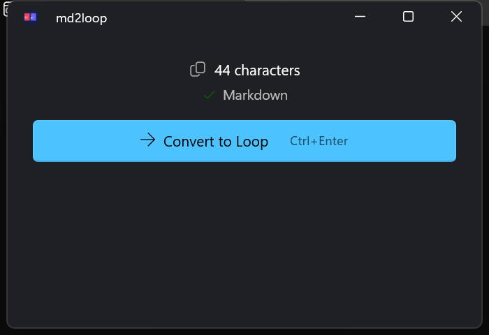
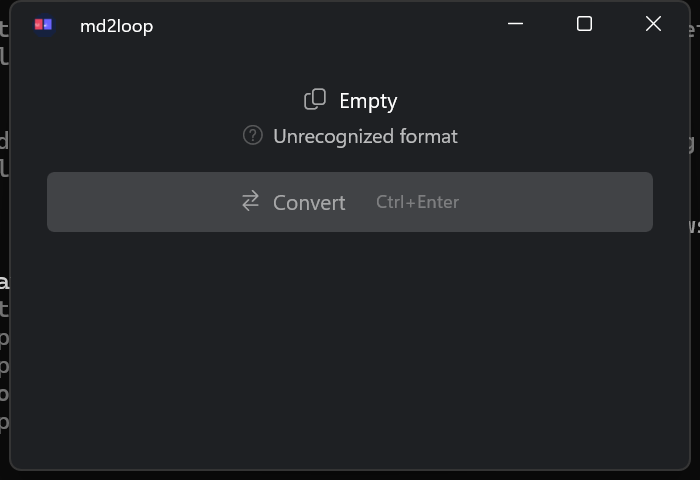

<p align="center">
  
</p>

<h1 align="center">md2loop</h1>

<p align="center">
  A lightweight Windows utility that converts Markdown ↔ Rich Text for seamless pasting into Microsoft Loop.
</p>

<p align="center">
  
  
  
  
  
  
</p>

---

Windows port of [md2loop](https://github.com/trsdn/md2loop) (originally macOS/Swift).

## Screenshots

<p align="center">
  
  &nbsp;&nbsp;
  
</p>

## Features

- **Markdown → Loop** — Converts clipboard Markdown to optimized HTML for pasting into Loop
- **Loop → Markdown** — Converts Loop's rich text back to clean Markdown
- **Auto-detection** — Automatically detects content type (Markdown vs HTML)
- **One shortcut** — `Ctrl+Enter` does the right thing based on content
- **Full Markdown support** — Headings, bold/italic, lists, tables, code blocks, task lists, links, blockquotes
- **Native Windows app** — WinUI 3, Mica backdrop, dark mode

## Installation

### Download (recommended)

Grab the latest release from the [Releases page](https://github.com/trsdn/md2loop-windows/releases):

| File | Description |
|------|-------------|
| `md2loop-setup-x.y.z.exe` | **Installer** — with Start Menu, Desktop shortcut, optional autostart |
| `md2loop-win-x64.zip` | Portable ZIP (Intel/AMD 64-bit) |
| `md2loop-win-arm64.zip` | Portable ZIP (ARM64 — Surface Pro, Snapdragon) |

The installer handles everything — just run it. No .NET runtime needed.

### Build from source

```powershell
git clone https://github.com/trsdn/md2loop-windows.git
cd md2loop-windows\md2loop
dotnet build
dotnet run
```

### Publish single-file executable

```powershell
dotnet publish -c Release -r win-x64 --self-contained true -p:PublishSingleFile=true -p:PublishTrimmed=true -o publish
```

## Usage

1. Copy Markdown text to your clipboard
2. Open md2loop — it auto-detects the content type
3. Click **Convert to Loop** (or press `Ctrl+Enter`)
4. Paste into Microsoft Loop (`Ctrl+V`)

Works the other way too — copy rich text from Loop, convert to Markdown.

## How it works

| Component | Purpose |
|-----------|---------|
| `ClipboardContentDetector.cs` | Regex-based detection of Markdown vs HTML |
| `ClipboardManager.cs` | Windows clipboard read/write (HTML + text formats) |
| `LoopHtmlConverter.cs` | Markdown → Loop-optimized HTML via [Markdig](https://github.com/xoofx/markdig) |
| `HtmlToMarkdownConverter.cs` | HTML → Markdown via [HtmlAgilityPack](https://html-agility-pack.net/) |
| `MainPage.xaml(.cs)` | WinUI 3 UI with clipboard polling + Ctrl+Enter shortcut |

### Loop-specific optimizations

- No CSS classes in output HTML
- Unicode checkboxes (☑/☐) for task lists
- Minimal table HTML
- Multi-format clipboard (HTML + plain text) for maximum compatibility

## Requirements

- Windows 10 version 1809 or later
- No runtime dependencies when using the release build (self-contained)
- [.NET 8 SDK](https://dotnet.microsoft.com/download/dotnet/8.0) only needed for building from source

## Contributing

Contributions are welcome! Please open an issue or PR.

## License

MIT — see [LICENSE](LICENSE) for details.
